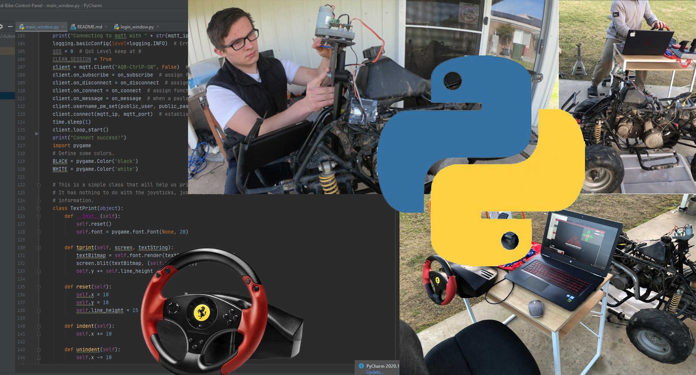

# Automated IoT Quad Bike: Control Panel
### School Assessed Task: Systems Engineering


## Table of contents
* [General info](#general-info)
* [Technologies](#technologies)
* [Setup](#setup)

## General info
This project is developed entirely by Liam Price in order to pass the Systems Engineering SAT at BSSC. The overall function of this software is to remotely control an electrically automated petrol engine quad bike which I am also developing for Systems Engineering.
Here is the repository for the Arduino software: https://github.com/LeehamElectronics/AQB-Arduino/blob/main/README.md

Here is a YouTube video with a basic demonstration of the system: https://www.youtube.com/watch?v=ic49dhoIEfM
	
## Technologies
Project is created with:
* PyCharm Community Edition
* MQTT (paho-mqtt): 1.5.0
* tkinter
	
## Setup
To run this project, download it:

```
Go To Releases
Download as ZIP
Install all the required modules from requirements.txt (should be automatic in PyCharm)
Run MainWindow.py or open the entire folder in PyCharm
Alternatively download the latest commit if you want to see what stage I am up to.
```
